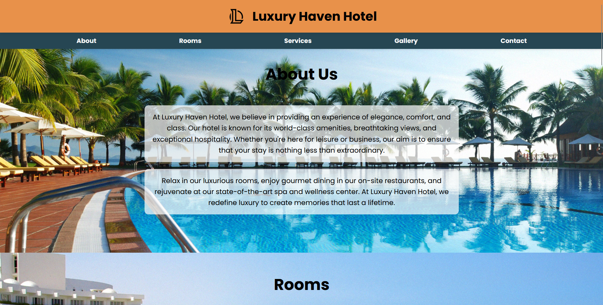

<div align="center">

# 🏨 Luxury Haven Hotel

### A modern, responsive hotel website built with HTML, CSS, and JavaScript

## [View Live Demo](https://sainath-666.github.io/Hotel_Website/)



</div>

## ✨ Features

- **Fully Responsive Design** - Looks great on all devices from mobile to desktop
- **Modern UI/UX** - Clean and elegant user interface with smooth animations
- **Room Booking System** - Interactive room selection and booking functionality
- **Service Showcase** - Highlights the hotel's premium amenities and services
- **Image Gallery** - Displays beautiful hotel images in a responsive grid layout
- **Contact Form** - Easy-to-use contact form for customer inquiries

## 🚀 Installation

```bash
# Clone the repository
git clone https://github.com/sainath-666/Hotel-Website.git

# Navigate to the project directory
cd Hotel-Website

# Open index.html in your browser
```

## 💻 Technologies

- **HTML5** - For structuring the content
- **CSS3** - For styling with responsive design principles
- **JavaScript** - For interactive elements and smooth scrolling
- **Font Awesome** - For beautiful icons
- **Google Fonts** - For typography

## 📱 Responsive Design

The website is fully responsive and optimized for:
- Mobile devices
- Tablets
- Laptops
- Desktop screens

## 🔮 Future Enhancements

- Implement a full booking and reservation system
- Add user authentication
- Integrate with a backend for dynamic content
- Add room availability calendar
- Implement customer reviews section

## 📞 Contact

[](https://www.linkedin.com/in/sainath666)
[](https://github.com/sainath-666)

<div align="center">
  <p>Made with ❤️ by Sainathreddy</p>
</div>
